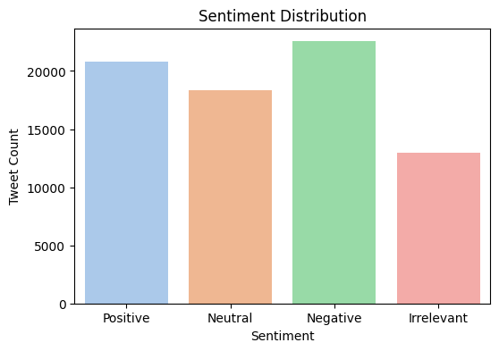
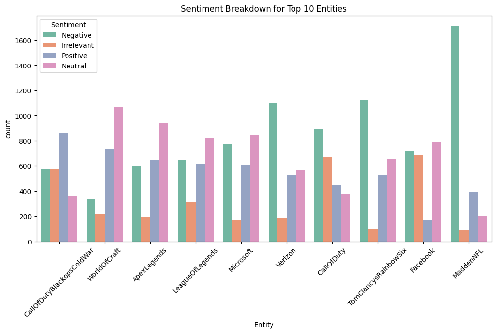

# 🐦 Twitter Sentiment Analysis (PRODIGY_DS_04)

This project analyzes public sentiment from tweets using a labeled dataset. It includes text preprocessing, data visualization, and a basic sentiment classification model.

## 📁 Dataset
- Source: [Kaggle - Twitter Entity Sentiment](https://www.kaggle.com/datasets/jp797498e/twitter-entity-sentiment-analysis)
- File used: `twitter_training.csv`

## 🔍 Key Tasks
- Preprocess and clean tweet text
- Visualize sentiment distribution
- Generate entity-wise sentiment breakdown
- Train a logistic regression model to predict sentiment

## 📊 Visual Outputs

### 🔹 Sentiment Distribution

### 🔹 Entity Sentiment Breakdown

## 🚀 How to Run
- Open `PRODIGY TASK 4.ipynb` in Google Colab or Jupyter
- Upload `twitter_training.csv` when prompted
- Run all cells to see outputs

---

